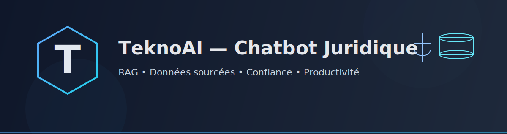

  

# 💼 Présentation pour Wafa – “Chatbot Juridique TeknoAI”

## 🟢 Introduction : Vision du projet

Le projet **TeknoAI** vise à créer un **assistant conversationnel intelligent** capable de répondre avec précision aux **questions juridiques** à partir des **textes de loi officiels**.
L’objectif est double : **améliorer la productivité interne** et **offrir un service client plus rapide et fiable**.

> En d’autres mots, nous utilisons **vos propres textes juridiques** pour créer **votre intelligence interne** — un chatbot unique, aligné sur **votre expertise** et **vos besoins**.

## 🧭 1. Objectifs et valeur ajoutée

### 🔹 Gains internes

* Répondre instantanément aux questions des collaborateurs sur la réglementation.
* Réduire le temps passé à chercher ou vérifier un article de loi.
* Concentrer les experts sur l’analyse et la stratégie plutôt que sur la recherche.

### 🔹 Gains externes

* Offrir aux clients un accès rapide et fiable à des réponses basées sur vos sources.
* Améliorer l’image d’innovation et la confiance dans vos services.
* Assurer une disponibilité 24h/24, sans perte de cohérence.

## ⚙️ 2. Notre approche technique : le RAG (Retrieval-Augmented Generation)

Notre solution repose sur une **architecture RAG**, qui combine deux éléments :

1. **Une base de connaissances interne** (vos textes de loi, nettoyés, découpés et encodés).
2. **Un modèle de langage intelligent**, capable de comprendre une question et de générer une réponse claire **fondée sur ces documents**.

### 🔸 Étapes techniques

* Extraction des textes depuis vos documents PDF.
* Découpage (*chunking*) pour identifier les passages de loi pertinents.
* Encodage vectoriel via un modèle d’**embedding** (*SentenceTransformer*).
* Stockage sémantique dans une base **Pinecone** pour la recherche rapide.
* Chatbot intelligent (via **Mistral** ou **Llama**) qui répond en s’appuyant sur les sources retrouvées.

## 🧱 3. Architecture simplifiée (pipeline TeknoAI)

[PDFs / Textes de loi]
       │
       ▼
[Extraction & Nettoyage]
       │
       ▼
[Chunking → Embeddings]
       │
       ▼
[Base Vectorielle Pinecone]
       │
       ▼
[Chatbot TeknoAI : interface utilisateur]
       │
       ▼
[Réponses sourcées et vérifiables]

*(Schéma à présenter en slide avec flèches et icônes d’étapes)*

## 🧩 4. Sécurité, transparence et conformité

* **Données 100 % maîtrisées** : hébergement contrôlé, aucune exposition publique.
* **Traçabilité** : chaque réponse renvoie vers sa **source exacte** (article, document, date).
* **Éthique et fiabilité** : aucune hallucination — le modèle ne crée rien qui n’existe pas dans vos textes.
* **Mise à jour continue** : le système peut intégrer les nouvelles lois ou révisions automatiquement.

## 🚀 5. Prochaines étapes proposées

| Étape | Description                                   | Livrable                       |
| ----- | --------------------------------------------- | ------------------------------ |
| **1** | Validation des documents à intégrer           | Liste et corpus final          |
| **2** | Démonstration du prototype (ébauche actuelle) | Démo Streamlit / Notebook      |
| **3** | Affinage des prompts et de l’interface        | Version alpha                  |
| **4** | Déploiement test sur environnement sécurisé   | Version beta                   |
| **5** | Formation + livraison finale                  | Chatbot juridique opérationnel |

---

## 💬 Conclusion

Le projet **TeknoAI** transforme une documentation juridique complexe en **un atout intelligent** :

✅ Précis
✅ Rapide
✅ Et entièrement sous votre contrôle

> “Notre mission est simple : rendre vos textes de loi intelligents et utiles, pour vos équipes comme pour vos clients.”

